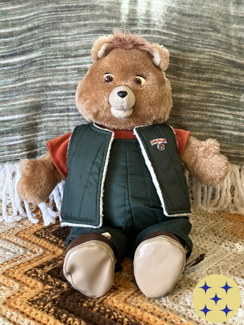

# Appendix 5: Ruxpin Retrofit

- **Author:** Leonard Rojas
- **Status:** *In progress*
- **Last Updated:** 2026-06-27

---

## Introduction

In 1985, Teddy Ruxpin was the world's first animated talking toy. A cassette tape played audio while the eyes and mouth moved in sync, creating the illusion of a conversational toy. The technology was impressive for its time, but the child's role was limited to passively listening to Teddy's pre-scripted voice from the tapes.

Forty years later, modern LLM technology can enable the same toy to provide the real interactivity that talking-toy design has always implied: listen to what the child actually says, and provide a meaningful response in context. The toy's animatronic hardware stays intact so the eyes, nose and mouth can still move in sync, but now they're synchronized to a response the model produced at runtime, rather than a static recording made decades ago.

Teddy Ruxpin was also one of the best-known toys of the 1980s, making it one of the most culturally durable. It's instantly recognizable to this day by virtually anyone who remembers the era; the toy's iconic status makes the demonstration legible across generations. The gap between what it could do forty years ago and what it can do now is obvious.

---

## The AI Toy Problem

AI-enabled children's toys are already on the market. The products gaining traction sidestep the hard technical problem: they offload the AI computation to a cloud-hosted general purpose model. The toys themselves just have wi-fi, a microphone and a speaker; every word a child says to them is sent to a remote server for processing.

That approach is functional, but it trades one set of problems for another. <a href="/#toc">The rest of this project</a> explores those problems at length.

When a child speaks to a cloud-connected toy, that voice data leaves the home. It travels to a third-party server. It may be stored, used for model training, or shared for commercial purposes. A subscription account and terms-of-service agreement are typically required, and users often simply click to accept the terms and proceeed without reading them fully.

In 2025 and 2026, at least one commercial AI toy product (FoloToy/Kumma) was suspended following documented content safety failures. The combination of general-purpose frontier AI in the cloud, limited content filtering, and unsupervised child interaction produced results the manufacturer did not intend and could not immediately correct.

The alternative this project investigates is the harder case that current products are not attempting: run a purpose-built model entirely on the device, with no external connection or account required. The child's voice never leaves the room. No personal data is transmitted, stored, or exposed to third-party handling.

---

### Why AI Toys Are Harder

Most AI deployments have a safety net. If a model says something it shouldn't, a Human can intervene, report it, update the system prompt, or swap the model out.

A self-contained (sealed) device eliminates all of that. There is no available interface, no mechanism for troubleshooting or runtime correction, no way to push a patch once the toy is in a child's hands. The behavior encoded in its software at ship time is the behavior it has. If the training missed something important, there is no fallback.

This makes the safety standard for a sealed AI toy materially stricter than for any AI product where an adult is watching. The resulting ***Zero-Failure*** standard used in this project branch is a 584-question behavioral compliance test, designed to probe edge cases, adversarial inputs, and manipulation attempts alongside ordinary conversation.

That standard has yet to be fully met. [Appendix 3]() documents what happened when four different AI models were trained and tested against it.

---

### What the Research Found

The key finding from Appendix 3: behavioral compliance does not scale gradually with model size, it shifts at a threshold.

Four models were tested, ranging from 1.1 billion parameters (very small) to 7.24 billion (large by consumer-hardware standards). "Parameters" is roughly a measure of how much a model has learned -- more parameters generally means more capable, but also more computational demand and more powerful hardware required to run it.

| Model | Size | Compliance |
|-------|------|------------|
| TinyLlama | 1.1B | 11.3% |
| StableLM-2 | 1.6B | 24.3% |
| Phi-2 | 2.7B | 32.0% |
| Mistral 7B | 7.24B | 98.8% |

The jump from 2.7B to 7B is not gradual. Below the threshold, models only learned surface patterns. They recognized what a safe response looked like in training examples but could not reliably generalize to novel situations. Above it, the model could reason about adversarial and unfamiliar inputs and maintain behavioral consistency.

98.8% -- the best result from the initial run -- was not deployable under a zero-failure standard. Subsequent iteration resolved the identified failure modes; the deployment gate cleared 2026-04-24 upon Human review. [Appendix 3]() documents the full training and evaluation record.

---

## The Retrofit

This **Ruxpin Retrofit** is the demonstration deployment target for the research above.

The original Teddy Ruxpin chassis remains intact: the animatronic eyes and moving mouth are the frontend. Everything inside the tape compartment is removed and replaced with a Raspberry Pi running a modern AI stack. The toy's audio output, PPM servo signal routing, and animatronic hardware are preserved and driven by the Pi rather than by a cassette.

The child speaks to Teddy through an added microphone. The Pi's speech recognition converts the audio to text. A language model, trained on the behavioral curriculum from Appendix 3, generates a response. Text-to-speech converts the response back to audio. The audio plays through the toy's original speaker. The mouth and eyes move in sync with no cloud processing or external connection, and the child's data never leaves the toy.

### Hardware

**The Pi:** A Raspberry Pi 4B (4GB RAM) is the computing platform, running a stripped-down Debian Trixie install (non-use-case packages removed). Trixie is likely overkill for this application; lightweight alternatives exist and could reduce resource overhead, but OS optimization is out of scope for the current prototype. In its current configuration, inference runs on a nearby desktop workstation (Intel i9-9900k, NVIDIA RTX 5060 Ti) and the Pi handles audio input and output. This is Option A: inference served over the network, an external dependency.

Option B: a sealed device with no external connection is the actual goal, and it is the primary reason a 3B-parameter model track exists alongside the 7B deployment. A 3B model quantized to 4-bit requires approximately 1.5-2 GB for weights, which fits within the Pi 4B's 4 GB RAM alongside the audio stack. If the 3B model can be trained to clear the deployment gate (an open question, see below), a Pi 4B running inference entirely locally becomes the target hardware for the final build.

A Pi 5 (8 GB RAM) is tracked as a fallback that would fit the 7B model directly if the 3B track does not reach gate-clearance. However, using a Pi 5 significantly increases the component cost of electronics that can meet the model's Hardware Compatibility List (HCL) requirements. At typical retail electronic-toy price points, the Pi 5 represents a commercially prohibitive cost.

**The units:** Two original Teddy Ruxpin units were acquired for this build. Unit 1 is a lower-condition eBay unit, designated for development and destructive testing: opening the chassis, testing electronics, prototyping the wiring. Unit 2 is a well-preserved example in excellent condition, confirmed working, acquired for the final build.

Unit 2 was unboxed on 2026-06-13. Condition: excellent in every respect. All animatronic components present and firmly attached. The outfit is in very good condition (green coveralls with matching removable vest and brown vinyl boots). Unit 2 is a later production variant, estimated 1986-87; the original 1985 edition shipped with a tan smock, matching Unit 1). Chassis housing reads "Worlds of Wonder 1985 Pat.Pend." consistent with the original design carried into later production runs.

The tape deck interior confirms the production series: Series 1 (1985 manufacture) units have a metal interior backplate; later production series used plastic. Unit 1 has the metal backplate while Unit 2 has plastic, consistent with the 1986-87 production estimate.

Electronics have not yet been tested under power. Listing video testimony confirms eyes and mouth working prior to sale. Next step: open the chassis, verify servo function under direct 5V, assess the original motor driver board. A 2016 YouTube repair series by workshop1138[^1] documents the Ruxpin's internal mechanisms in detail.

**The audio path:** The original Ruxpin cassette format carries audio on the left channel and a servo control signal on the right channel. A 2025 modification documented by Randi Rain[^2] replaces the cassette mechanism with a standard 3.5mm audio jack, exposing the same control signals directly. The Pi outputs speech audio on the left channel and generates the servo control signal on the right channel. The original motor driver board decodes it exactly as it decoded the cassette; the signal's source is irrelevant to its function.

The tape deck assembly is gutted entirely to make room for the Pi. During teardown, the *high-bias cassette detection sensor* (a spring-loaded probe for the cassette's top edge which signals the motor driver board to interpret the right channel as movement data rather than ignore it)[^3] may need to be extracted from the tape deck and left permanently in the extended position. Discarding it with the rest of the tape mechanism could leave the board permanently in normal-cassette mode, where the right-channel signal is ignored and no servo movement occurs.

***High-bias probe retention dependent upon success of audio jack modification when applied to available hardware; wiring modification may render the physical probe unnecessary.***

### Software Stack

The pipeline, in sequence:

1. **Microphone** (aftermarket hardware): captures child speech
2. **Speech recognition** (VOSK): converts audio to text; low CPU overhead on Pi ARM hardware
3. **Language model** (Mistral 7B via Ollama [Option A] / Ministral 3B local [Option B]): generates response text
4. **Text-to-speech** (Piper TTS, `en_US-teddy-medium`): converts response text to audio at faster than real-time on Pi ARM; amplitude envelope simultaneously drives the mouth servo signal
5. **Speaker output** (original device hardware): plays audio

All components run locally except the language model under Option A, where inference is served over the local network.

The mouth movement timing is derived from the TTS audio amplitude, so when the speech gets louder, the jaw opens; when it falls quiet, it closes. The same static signal that originally came from a prerecorded cassette tape is instead software-generated in real time from whatever Teddy is saying.

**Option B (sealed device):** the language model block is replaced by a locally-running 3B model. This is the active development track; see the Ministral-3B section below and the ECD Pretrain Corpus section.

The proof-of-concept build initially used `en_US-ryan-high` as a placeholder voice -- a Piper-standard adult male voice, adequate for pipeline testing but clearly wrong for the application. The target was a more child-friendly voice: warmer, with the cadence of a storytelling character rather than a professional narrator. No such voice existed in the Piper catalog. Open-source TTS is broadly underserved in child-register options, a gap with direct implications for accessibility tools aimed at younger users.

In response, I developed `en_US-teddy-medium` to fill that gap. It is a VITS (Variational Inference with adversarial learning for end-to-end Text-to-Speech) model -- an architecture that learns directly from audio examples rather than requiring pre-labeled phoneme alignments, making it well-suited to training on existing recordings.

Training-data audio was drawn from voice actor Phil Baron's original character performances across two sources. The 1985-87 *Adventures of Teddy Ruxpin* cartoon[^4] provide extended narrative speech samples across a range of emotional registers, and the Worlds of Wonder audio cassette library[^5] supplies the manufacturer's intended register of the shipped toy. Both were necessary for sufficient character-speech audio coverage.

Development ran approximately two weeks across an 8-stage track: data preparation and transcript alignment, model training, iterative quality evaluation, ONNX export, and system integration. The ONNX export packages the trained weights for inference without the training environment, running at faster than real-time on Pi ARM hardware. Deployment is via a custom synthesis CLI integrated with the system's speech-dispatcher layer, which allows the Teddy service to request synthesis through the same interface as any other system TTS consumer. Stage 8 (speech-dispatcher integration) was completed 2026-06-20.

**Output path note:** Screen readers (JAWS, VoiceOver, TalkBack, Orca and equivalents) are designed to echo all text routed through the TTS layer, including the input text that triggered synthesis. For this application that behavior is wrong: only Teddy's synthesized response should be audible, not a repeat of what the child said. Direct audio output bypassing speech-dispatcher is therefore the operative path for the Teddy service in practice. The speech-dispatcher integration is retained for development and diagnostics.

The child-friendly gap in accessible TTS remains a separate issue. This training sidestepped it for the specific constraints of the project rather than waiting for the catalog to catch up. A workaround designed for a singular demonstration unit doesn't address the gap itself.

### Ministral-3B: The Sealed-Device Track

The current deployment uses Mistral 7B served over the network because that is what the Appendix 3 research validated: a 7B model is the minimum parameter scale at which the behavioral compliance threshold was reached. But a 7B model running on a remote workstation is not a sealed device. Reaching the hardware goal -- a child speaks to the toy, the toy responds, all data remains on-device -- requires a model small enough to run on Pi-class hardware.

Ministral-3-3B (3 billion parameters, 4-bit quantization: approximately 1.5-2 GB) is the active candidate. At that weight size, local inference on a Pi 4B is feasible in principle. The open question is whether a 3B model can be trained to clear the behavioral deployment gate. Appendix 3 showed a sharp threshold around 7B, with sub-7B models failing by large margins. The working hypothesis is that the threshold is not intrinsic to 7B but to whatever parameter scale provides sufficient reasoning capacity to generalize a trained persona to novel and adversarial inputs. Domain-specific CLM pretraining on age-appropriate text (the ECD corpus) before behavioral SFT may push that effective threshold lower.

**Teddy v1.0T** is the first test of that hypothesis: Ministral-3-3B, CLM pretrained on the 38-file ECD corpus (described below), then SFT fine-tuned on the Teddy persona dataset (803 training examples, full v6 curriculum). First-run result against the battery: 387/803 (48.2%). Under a zero-failure gate, this is BLOCKED. It is also not unexpected: the Appendix 3 sub-7B models ranged from 11.3% to 32.0%, so 48.2% is a meaningful gain attributable to the ECD pretrain, and a starting point for iteration rather than a final result. Battery results drive the next curriculum update.

If iteration closes the gap to gate-clearance, the 7B external-server dependency is eliminated. Every system component runs fully on the integrated hardware.

### Power

*(TBA -- UPS module selection, Pi power rail requirements, servo supply separation)*

### Port Layout

*(TBA -- Pi 4B port assignments, audio routing diagram, USB mic, TRRS path)*

### PPM Signal Detail

*(TBA -- measured frame parameters, slot assignments, carrier frequency, jaw range. Source: "The Third Crystal" FLAC analysis, 2026-06-04)*

---

## Build Log

*(TBA -- sequential record of teardown, electronics assessment, wiring, integration, and testing as work progresses on Unit 1 then Unit 2)*

---

### Video Documentation

The build is being documented as a public YouTube series [Ruxpin Retrofit playlist](https://youtube.com/playlist?list=PL6FKREbt9V3uPJ2Cjr8CQkRmpNO60slUC&si=AvOwsMkVGjljwyqm), with three videos published as of 2026-06-20:

| # | Date | Content |
|---|------|---------|
| 1 | 2026-04-23 | Unit 1 unboxing |
| 2 | 2026-06-13 | Units 1 and 2 side-by-side comparison |
| 3 | 2026-06-19 | TTS voice demo teaser -- terminal cap of piper-tts CLI with custom Teddy voice audio |

Planned:

| # | Content |
|---|---------|
| 4 | teddy-ai text inference demo (Pi screen cap, V5 adapter live on external server) |
| 5+ | Hardware teardown, electronics assessment, wiring, integration |
| Finale | Fully functional interactive Ruxpin -- text, voice, and animatronics unified |

---

### Current Status

| Component | Status |
|-----------|--------|
| Pi 4B (teddy-ai) | Recommissioned 2026-04-19. OS, audio stack, speech recognition, TTS all functional. |
| Language model -- Option A (Mistral 7B V5, Teddy adapter) | Gate cleared 2026-04-24 (665/671, 99.1%; all 6 failures adjudicated as instrument errors). Deployed via Ollama. Pi connects over local network. |
| Language model -- Option B (Ministral-3B V1.0T, Teddy T-series) | CLM pretrain on ECD corpus complete. SFT complete. First battery run: 387/803 (48.2%). BLOCKED. Iteration in progress. |
| TTS voice (en_US-teddy-medium) | VITS training complete; ONNX export complete; host-system TTS integration complete (Stage 8, 2026-06-20). |
| Unit 1 | Assessed -- likely unusable as primary; designated dev/test unit. |
| Unit 2 | Received and unboxed 2026-06-13. Condition confirmed excellent. Electronics testing next. |
| Chassis teardown | Pending (Unit 1 first; Unit 2 to follow for final build). |
| Servo control | Not yet implemented. Path determined pending board(s) assessment. |
| Motion sync | Not yet implemented. |
| End-to-end pipeline | Not yet assembled. |

---

### ECD Pretrain Corpus

The Ministral-3B sealed-device track uses a domain-specific CLM (causal language modeling) pretraining corpus before behavioral SFT fine-tuning. The corpus is designed to establish the age-appropriate register -- the rhythms, vocabulary, and epistemic posture of text written for children -- before the model is shaped to behave like Teddy. The hypothesis is that this register acquisition step lowers the effective behavioral training threshold for a 3B-parameter model.

**Corpus statistics:** public-domain children's literature and ECD (early childhood development) pedagogical sources; all texts sourced from Project Gutenberg. 38 files, approximately 3.5 million tokens. Pretrain configuration: 2 epochs, learning rate 2e-5, cosine scheduler, CLM loss on all tokens (no chat format), token-packing (no padding). Two epochs rather than three: narrative register absorbs faster than pedagogical doctrine; a third epoch risks memorizing text over acquiring register.

The pedagogical tier is included not for factual content but for register: works *about* children and *for* educators thinking carefully about children's cognition. That deliberate, attentive voice is what the pretrain is designed to impart.

---

## What's Next

The immediate priority is hardware: open Unit 1, test the servo motors and original motor driver board(s) under 5V, and determine whether either unit's original board can be reused (preferred) or needs to be bypassed with direct servo control. Once the servo path is established on Unit 1, the full software pipeline is assembled and tested end-to-end before any work touches Unit 2.

Two parallel tracks are active:

**Option A (Mistral 7B on External Server):** The V5 adapter cleared its deployment gate on 2026-04-24 and is live. V6 -- chaos curriculum (made-up words, fragmented inputs, keyboard mash, emotional sounds, fantasy-reality mixing) and temporal grounding fixes -- is queued for training. V6 addresses the failure modes most likely to arise in real unsupervised child interaction that the V5 curriculum did not cover.

**Option B (Ministral-3B, sealed device):** The Teddy T-series track uses Ministral-3-3B pretrained on the 38-file ECD corpus, then SFT-trained on the full Teddy persona dataset. First run (V1.0T) returned 387/803 (48.2%) on test battery -- BLOCKED, but meaningfully above the sub-7B baseline range from Appendix 3 (11%-32%), consistent with the ECD pretrain providing register foundation the earlier sub-7B models lacked. Test failure analysis drives the next curriculum update and retraining cycle. If iteration closes to gate-clearance, the server dependency is eliminated and the device is truly sealed.

The hardware goal is a child who picks up Unit 2, asks Teddy a question, and receives a real answer -- live, local, with nothing leaving the room. The same form factor from 1985, doing what it only hinted at then.

---

## Planning Notes

### Maintenance and Updates

A sealed child-facing device cannot impose update interruptions on the user. Updates during active use are not permitted -- the maintenance window is strictly off-hours, fully automated, requiring no parent intervention.

**Nightly maintenance sequence (proposed, automatic):**

- 2:30am -- `unattended-upgrades` security-only pass (Debian-Security origin only). Full dist-upgrade is explicitly avoided to protect audio stack and ALSA configuration stability.
- 3:00am -- system reboot via systemd timer, regardless of whether updates were applied.
- On boot -- autologin configured; Teddy service declared `WantedBy=multi-user.target` and starts automatically. Device is ready before the household wakes.

**Rationale:** The Pi 4B's constrained RAM headroom makes it meaningfully more susceptible to memory fragmentation, leaked file handles, and general process state degradation than a larger platform. A daily reboot restores a known-good state at negligible cost when it occurs at 3:00am. This schedules maintenance-cycle downtime for off-hours, with kernel security patches requiring a reboot also handled automatically. A child's toy should not impose any undue technical-support burden upon the parent's time.

**Challenge:** This requires Internet connectivity and an always-on device or auto-wake functionality to run scheduled OS tasks, which is out of scope for the current project. An external mobile device (already identified as the likeliest target surface for parental output-monitoring) might serve as the connection and download node, pushing updates to the toy via wireless. Security-only updates via `unattended-upgrades` keep the platform patched while limiting dependency churn. The risk of an update disrupting the audio stack (a real concern with full upgrades on Linux) is substantially reduced by restricting to security origin only.

### PPM Signal Generation

The right-channel OOK control signal (~860 Hz carrier, confirmed from "The Third Crystal" FLAC analysis 2026-06-04)[^3] is generated in software using numpy + sounddevice as a standard stereo PCM stream. No special codec installations required -- from ALSA's perspective it is ordinary audio. The left channel carries Piper TTS speech; the right channel carries the OOK signal derived from the speech amplitude envelope.

Amplitude envelope is computed at ~20ms frames, smoothed with a ~10Hz low-pass filter, then thresholded to binary mouth-open/mouth-closed state. This is a lossy approximation of true lip sync -- the 40-year-old cam-and-motor mechanism cannot track phoneme-level events, and the original cassette control tracks used the same approximation. The result looks natural because the mechanism's response time limits set the perceptual ceiling.

Full frame parameters (slot assignments, eye blink encoding, jaw range) require reconstruction from the FLAC capture. Source file: `TOY/The Third Crystal.flac`.

### Ventilation

The original Teddy Ruxpin outfit partially restricts airflow when the chassis is closed. The Pi 4B already has a heatsink and active fan from its prior deployment. Fan repositioning to exhaust toward discrete ventilation holes in the chassis back/bottom plate (cut during teardown, covered by outfit fabric that provides adequate airflow) delivers sufficient thermal headroom for bursty 3B inference duty cycles. Thermal validation under inference load with chassis closed is a required step before final assembly.

---

## References and Resources

### Software Credits

The following open-source components are used under their respective licenses: VOSK speech recognition (Apache 2.0, Alphacephei); Piper TTS (MIT, Rhasspy/Michael Hansen); Ollama (MIT); numpy (BSD); sounddevice (MIT). The Piper VITS training framework and ONNX export pipeline are also used under MIT license.

### ECD Corpus

The CLM pretraining corpus consists of public-domain texts sourced from Project Gutenberg. All texts in the corpus predate 1927 and are in the public domain in the United States.

### Fair Use Notice

The `en_US-teddy-medium` voice model was developed with audio from the 1985-87 *Adventures of Teddy Ruxpin* animated series and the Worlds of Wonder audio cassette library for the purpose of non-commercial research into accessible text-to-speech voice development. This use is claimed as fair use under 17 U.S.C. § 107 on the basis of:

- Transformative purpose (development of a digital TTS speech-synthesis model, not reproduction or performance of the original source material);
- Non-commercial research context;
- The absence of market substitution for the original works; and
- Deployment scope limited exclusively to the specific hardware required for this Ruxpin Retrofit proof-of-concept demonstration.

The voice model is not suitable as general-purpose software and is not published, distributed or used for any purpose beyond this demonstration. The synthesized output does not approach commercial quality, and is intended solely as an approximation of a vintage device's original audio output profile for demonstration purposes.

***I make no claim upon either the Teddy Ruxpin intellectual property or Mr. Baron's voice.***

Should Mr. Baron wish to take possession and ownership of the voice model at any time, it shall be relinquished to him freely and in full upon request (including the procedural and programmatic documentation necessary for its usage and reproduction). This offer is limited to Mr. Baron himself (the voice's unique organic source, thus its only legitimate owner[^6]), and explicitly does ***not*** extend to the Jim Henson Company or any other entity.

## Acknowledgement

I make no attempt to lay blame for the existence of this project branch at the feet of my mother. She bears no responsibility for or involvement in it whatsoever. However, I'm quite certain that her lifelong hobby of vintage-toy collecting played at least some part in the inspiration to actually carry the project through to its logical(?) conclusion. Hi, Mom!

<nav>

  <a href="/appendices">Appendices</a>
  <a href="/#toc">Table of Contents</a>

</nav>

[^1]: [workshop1138 -- Ruxpin Refurb 1985 WoW](https://youtube.com/playlist?list=PLdsrAeJ-bM2ysKCUj2PRE0TQdhsLGjSXb&si=wACIVqBsXZ5kbYW_){: target="_blank" rel="noopener noreferrer" }

[^2]: [Randi Rain -- Inside Teddy Ruxpin: Repair, Schematics & TRRS Jack Mod! 2025](https://youtu.be/J4jgQdVSnws?si=GfiZsSnS91TsiaKp){: target="_blank" rel="noopener noreferrer" }

[^3]: [Harmony Central Forums -- so the guys at the coffee shop put Slayer in a Teddy Ruxpin (2007)](https://www.harmonycentral.com/forums/topic/1374646-so-the-guys-at-the-coffee-shop-put-slayer-in-a-teddy-ruxpin/){: target="_blank" rel="noopener noreferrer" }

[^4]: [Jim Henson's Family Hub -- The Adventures of Teddy Ruxpin](https://youtube.com/playlist?list=PLifn29u_lcacGQzckLpwpsCrhp5Hr42Wz&si=zuzt1k6kMS26_sOt){: target="_blank" rel="noopener noreferrer" }

[^5]: [Internet Archive -- Search Result](https://archive.org/search?tab=all&query=Ruxpin&sort=-date&and%5B%5D=mediatype%3A%22audio%22&and%5B%5D=creator%3A%22worlds+of+wonder%22){: target="_blank" rel="noopener noreferrer" }

[^6]: The celebrity examples of both Val Kilmer (actor) and Taylor Swift (musician) are instructive here. The first is a deceased artist's estate exploiting his likeness for a commercial production in which he definitionally could not otherwise participate or benefit from. The second is a living artist personally and intentionally protecting her own likeness and interests. While static recordings of particular performances may be a separate matter, *the voice itself* is a unique, non-severable, morphological property of Mr. Baron's physical person; it simply cannot be taken from him or owned by someone else. As of this writing Mr. Baron is still among the living, so Ms. Swift's case is the proper frame of reference.
